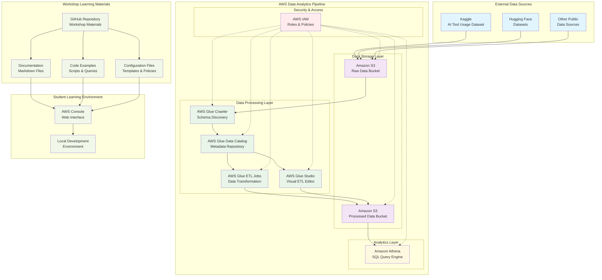
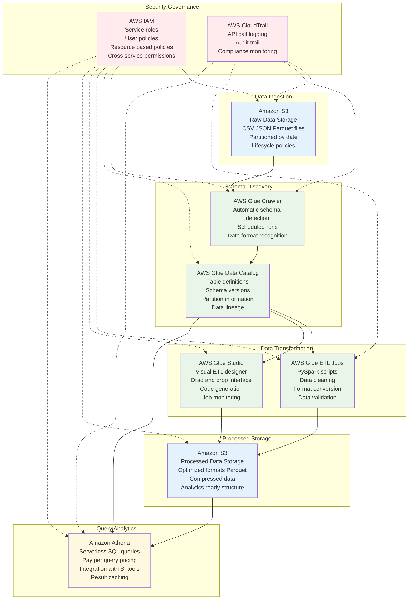
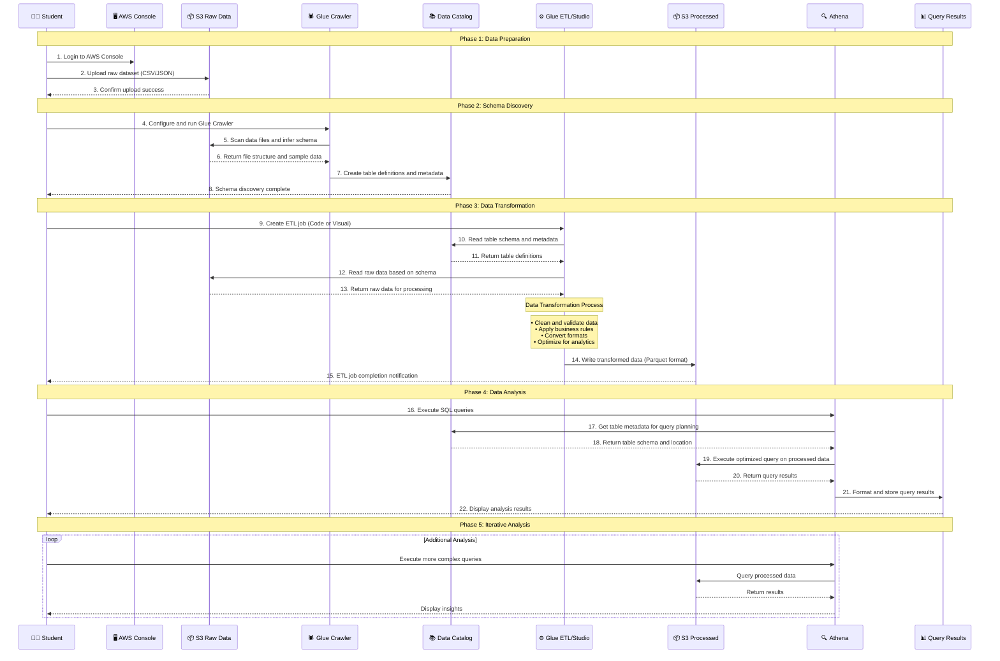
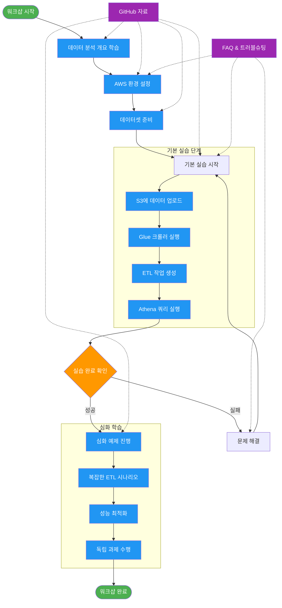
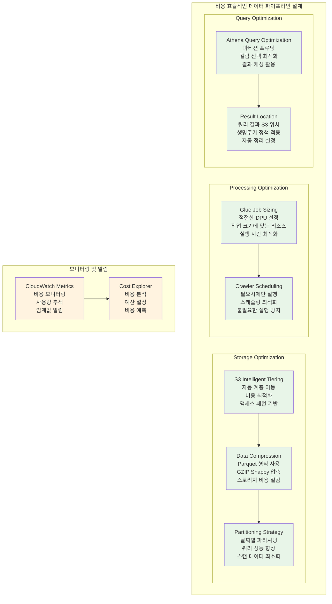

# AWS 데이터 분석 워크샵 아키텍처 다이어그램

이 문서는 AWS 데이터 분석 워크샵에서 사용되는 전체 아키텍처와 데이터 플로우를 시각화한 다이어그램들을 포함합니다.

## 1. 전체 데이터 파이프라인 아키텍처

## 2. AWS 서비스 간 연결 관계 상세 다이어그램

## 3. 데이터 플로우 시퀀스 다이어그램

## 4. 워크샵 학습 플로우 다이어그램

## 5. 비용 최적화 아키텍처 가이드

## 다이어그램 사용 가이드

### 1. 전체 아키텍처 다이어그램 활용
- 워크샵 시작 시 전체 구조 설명에 사용
- 각 컴포넌트의 역할과 관계 이해
- 학습 목표와 실습 범위 명확화

### 2. 서비스 연결 관계 다이어그램 활용
- AWS 서비스 설정 단계에서 참조
- 각 서비스의 구체적인 기능 설명
- 권한 설정 및 보안 고려사항 이해

### 3. 데이터 플로우 다이어그램 활용
- 실습 진행 순서 가이드
- 각 단계별 입출력 데이터 확인
- 문제 발생 시 디버깅 참조

### 4. 학습 플로우 다이어그램 활용
- 워크샵 진행 계획 수립
- 학습자 진도 관리
- 추가 학습 경로 안내

### 5. 비용 최적화 다이어그램 활용
- 실습 비용 관리 방법 설명
- 프로덕션 환경 적용 시 고려사항
- 지속 가능한 데이터 파이프라인 설계 가이드