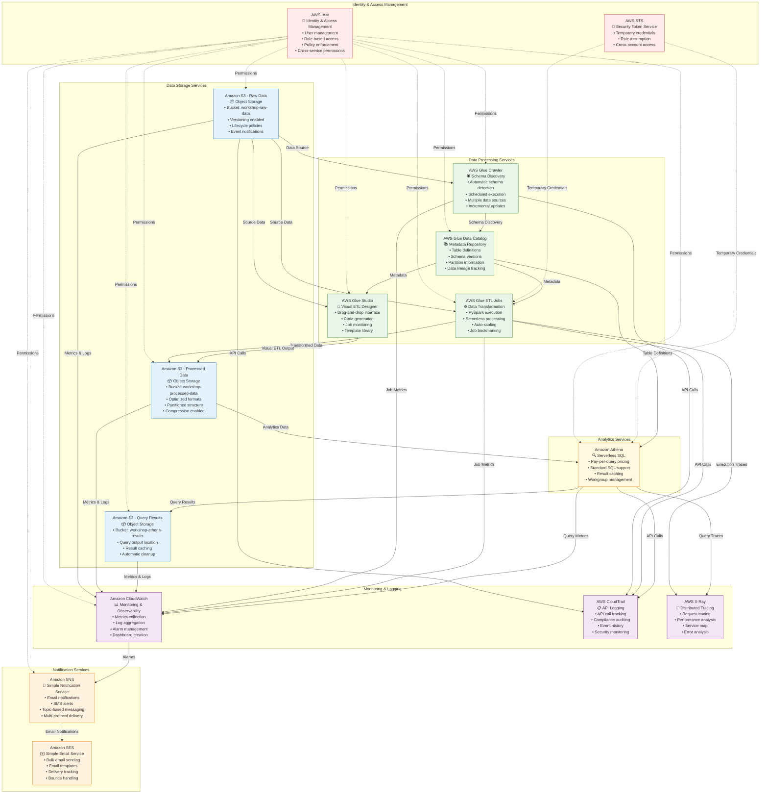
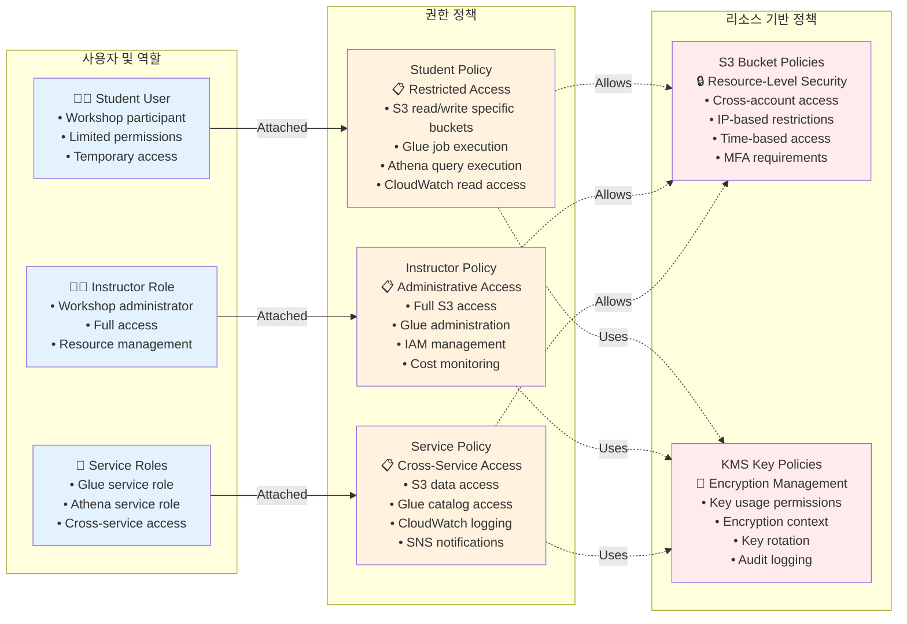
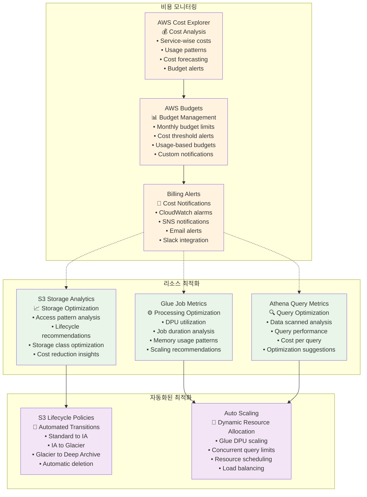
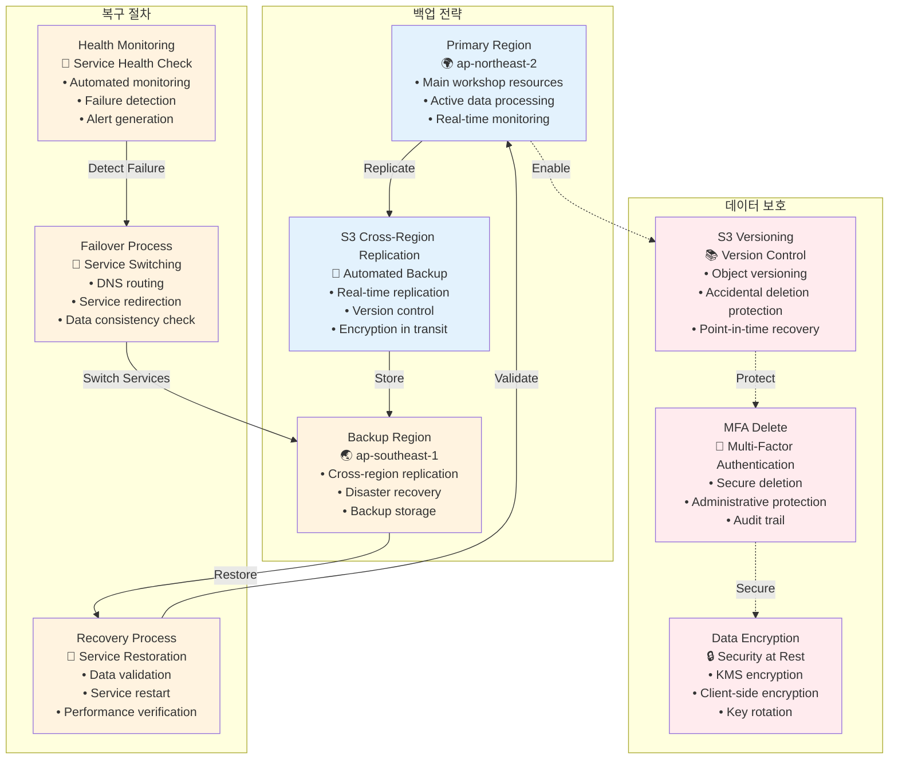

# AWS 서비스 통합 아키텍처 다이어그램

## 1. AWS 서비스 간 상세 연결 관계

## 2. 데이터 라이프사이클 관리

```mermaid
stateDiagram-v2
    [*] --> RawData : Data Upload
    
    state RawData {
        [*] --> Uploaded
        Uploaded --> Validated : Schema Check
        Validated --> Cataloged : Crawler Run
        Cataloged --> [*]
    }
    
    RawData --> Processing : ETL Trigger
    
    state Processing {
        [*] --> ETLJob
        ETLJob --> DataCleaning
        DataCleaning --> DataTransformation
        DataTransformation --> DataValidation
        DataValidation --> OutputGeneration
        OutputGeneration --> [*]
    }
    
    Processing --> ProcessedData : ETL Complete
    
    state ProcessedData {
        [*] --> Optimized
        Optimized --> Partitioned
        Partitioned --> Compressed
        Compressed --> Indexed
        Indexed --> [*]
    }
    
    ProcessedData --> Analytics : Query Ready
    
    state Analytics {
        [*] --> QueryExecution
        QueryExecution --> ResultGeneration
        ResultGeneration --> ResultCaching
        ResultCaching --> [*]
    }
    
    Analytics --> Archive : Lifecycle Policy
    
    state Archive {
        [*] --> InfrequentAccess
        InfrequentAccess --> Glacier
        Glacier --> DeepArchive
        DeepArchive --> [*]
    }
    
    Archive --> [*] : Data Retention Complete
```

## 3. 보안 및 권한 관리 아키텍처

## 4. 비용 최적화 및 모니터링

## 5. 재해 복구 및 백업 전략

## 통합 아키텍처 활용 가이드

### 1. 워크샵 설정 단계
- IAM 역할 및 정책 설정 참조
- 보안 및 권한 관리 아키텍처 활용
- 서비스 간 연결 관계 확인

### 2. 실습 진행 단계
- 데이터 라이프사이클 관리 플로우 참조
- AWS 서비스 간 상세 연결 관계 활용
- 모니터링 및 알림 설정

### 3. 비용 관리 단계
- 비용 최적화 및 모니터링 다이어그램 참조
- 리소스 사용량 추적
- 자동화된 최적화 설정

### 4. 문제 해결 단계
- 재해 복구 및 백업 전략 참조
- 서비스 상태 모니터링
- 복구 절차 실행

### 5. 워크샵 완료 후
- 리소스 정리 가이드
- 비용 최적화 검토
- 보안 설정 검증