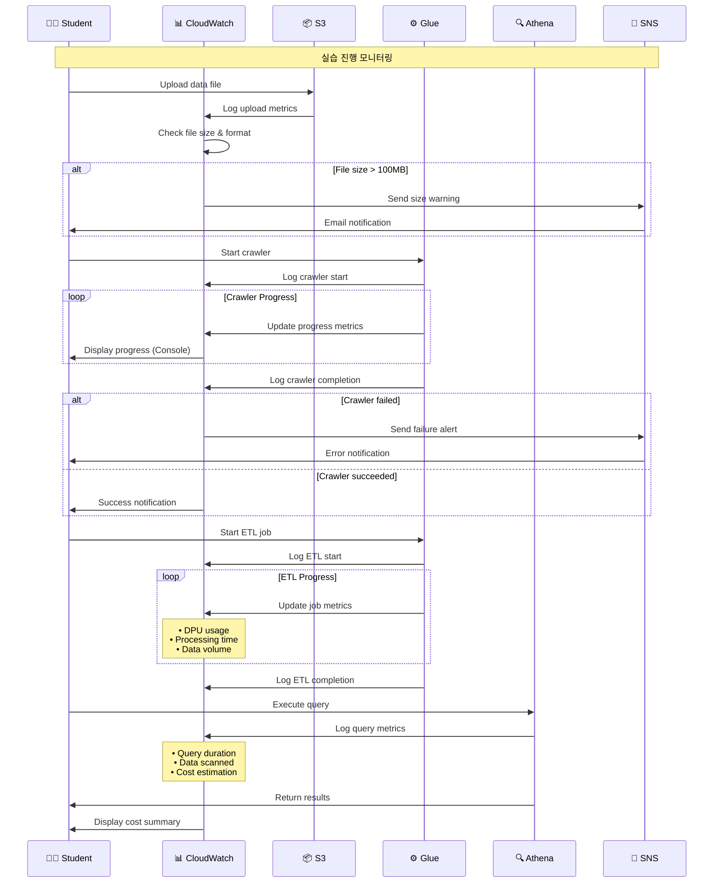
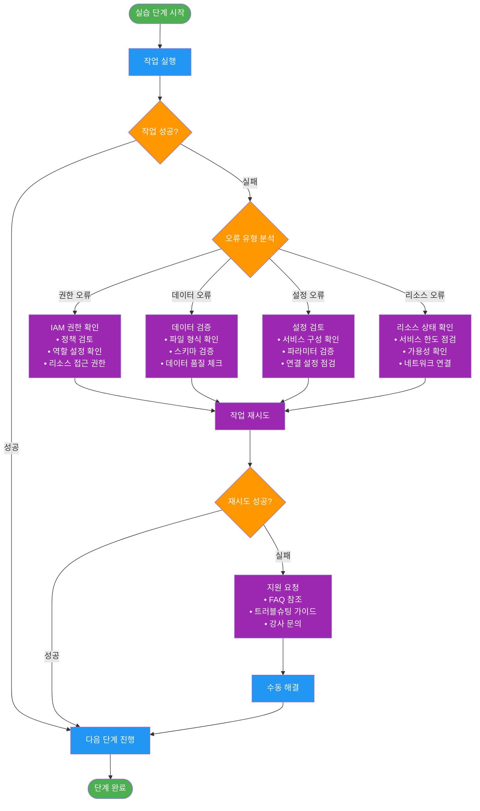
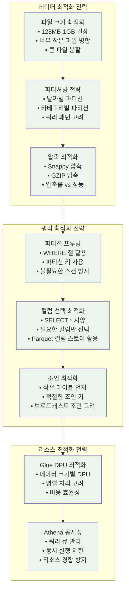

# 데이터 파이프라인 플로우 상세 다이어그램

## 1. 단계별 데이터 변환 플로우

```mermaid
flowchart LR
    subgraph "Raw Data Sources"
        CSV[CSV Files<br/>• Student survey data<br/>• Comma-separated<br/>• Headers included]
        JSON[JSON Files<br/>• API responses<br/>• Nested structures<br/>• Semi-structured]
        Parquet[Parquet Files<br/>• Columnar format<br/>• Compressed<br/>• Schema embedded]
    end
    
    subgraph "S3 Raw Data Bucket"
        RawBucket[s3://workshop-raw-data/<br/>├── csv/<br/>│   └── ai-tool-usage.csv<br/>├── json/<br/>│   └── student-profiles.json<br/>└── parquet/<br/>    └── survey-responses.parquet]
    end
    
    subgraph "Schema Discovery Process"
        Crawler[Glue Crawler<br/>• Scan file formats<br/>• Infer data types<br/>• Detect partitions<br/>• Create table schemas]
        
        CatalogTables[Data Catalog Tables<br/>• ai_tool_usage_csv<br/>• student_profiles_json<br/>• survey_responses_parquet]
    end
    
    subgraph "ETL Transformation Logic"
        DataCleaning[Data Cleaning<br/>• Remove null values<br/>• Standardize formats<br/>• Validate data types<br/>• Handle duplicates]
        
        DataEnrichment[Data Enrichment<br/>• Calculate derived fields<br/>• Add metadata<br/>• Apply business rules<br/>• Create aggregations]
        
        FormatConversion[Format Conversion<br/>• Convert to Parquet<br/>• Apply compression<br/>• Optimize partitioning<br/>• Add indexes]
    end
    
    subgraph "S3 Processed Data Bucket"
        ProcessedBucket[s3://workshop-processed-data/<br/>├── year=2025/<br/>│   ├── month=01/<br/>│   │   └── ai-tool-analytics.parquet<br/>│   └── month=02/<br/>│       └── ai-tool-analytics.parquet<br/>└── aggregated/<br/>    └── summary-statistics.parquet]
    end
    
    subgraph "Analytics Layer"
        AthenaQueries[Athena SQL Queries<br/>• Basic aggregations<br/>• Complex joins<br/>• Window functions<br/>• Statistical analysis]
        
        QueryResults[Query Results<br/>• CSV exports<br/>• JSON responses<br/>• Cached results<br/>• Visualization data]
    end
    
    %% Data Flow
    CSV --> RawBucket
    JSON --> RawBucket
    Parquet --> RawBucket
    
    RawBucket --> Crawler
    Crawler --> CatalogTables
    
    CatalogTables --> DataCleaning
    DataCleaning --> DataEnrichment
    DataEnrichment --> FormatConversion
    
    FormatConversion --> ProcessedBucket
    ProcessedBucket --> AthenaQueries
    AthenaQueries --> QueryResults
    
    %% Styling
    classDef source fill:#e3f2fd
    classDef storage fill:#f3e5f5
    classDef processing fill:#e8f5e8
    classDef analytics fill:#fff8e1
    
    class CSV,JSON,Parquet source
    class RawBucket,ProcessedBucket storage
    class Crawler,CatalogTables,DataCleaning,DataEnrichment,FormatConversion processing
    class AthenaQueries,QueryResults analytics
```

## 2. 실시간 모니터링 플로우

## 3. 오류 처리 및 복구 플로우

## 4. 성능 최적화 플로우

## 5. 보안 및 거버넌스 플로우

```mermaid
flowchart LR
    subgraph "데이터 보안 계층"
        Encryption[데이터 암호화<br/>• S3 서버 측 암호화<br/>• 전송 중 암호화<br/>• KMS 키 관리]
        
        Access[접근 제어<br/>• IAM 정책<br/>• 버킷 정책<br/>• ACL 설정]
        
        Network[네트워크 보안<br/>• VPC 엔드포인트<br/>• 보안 그룹<br/>• NACL 설정]
    end
    
    subgraph "감사 및 모니터링"
        Logging[로깅<br/>• CloudTrail 로그<br/>• S3 액세스 로그<br/>• Glue 작업 로그]
        
        Monitoring[모니터링<br/>• CloudWatch 메트릭<br/>• 알람 설정<br/>• 대시보드 구성]
        
        Compliance[컴플라이언스<br/>• 데이터 분류<br/>• 보존 정책<br/>• 규정 준수]
    end
    
    subgraph "데이터 거버넌스"
        Catalog[데이터 카탈로그<br/>• 메타데이터 관리<br/>• 스키마 진화<br/>• 데이터 계보]
        
        Quality[데이터 품질<br/>• 품질 규칙<br/>• 검증 프로세스<br/>• 이상 탐지]
        
        Lifecycle[생명주기 관리<br/>• 자동 아카이빙<br/>• 삭제 정책<br/>• 비용 최적화]
    end
    
    Encryption --> Access
    Access --> Network
    Logging --> Monitoring
    Monitoring --> Compliance
    Catalog --> Quality
    Quality --> Lifecycle
    
    Network -.-> Logging
    Compliance -.-> Catalog
    
    classDef security fill:#ffebee
    classDef monitoring fill:#fff3e0
    classDef governance fill:#f3e5f5
    
    class Encryption,Access,Network security
    class Logging,Monitoring,Compliance monitoring
    class Catalog,Quality,Lifecycle governance
```

## 다이어그램 활용 가이드

### 실습 단계별 다이어그램 매핑

1. **데이터 업로드 단계**: 단계별 데이터 변환 플로우 참조
2. **크롤러 실행 단계**: 실시간 모니터링 플로우 참조
3. **ETL 작업 단계**: 성능 최적화 플로우 참조
4. **쿼리 실행 단계**: 오류 처리 및 복구 플로우 참조
5. **보안 설정 단계**: 보안 및 거버넌스 플로우 참조

### 문제 해결 시 참조 순서

1. 오류 발생 → 오류 처리 및 복구 플로우
2. 성능 이슈 → 성능 최적화 플로우
3. 보안 문제 → 보안 및 거버넌스 플로우
4. 모니터링 필요 → 실시간 모니터링 플로우